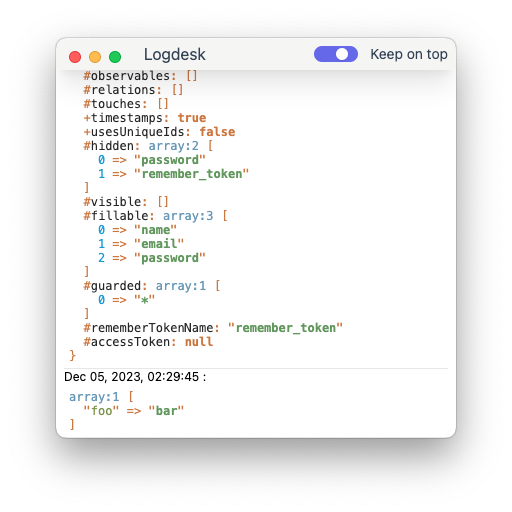

# logdesk

A logger desktop app



## Install

```bash
npm install -g yarn
yarn install
```

## Development

```bash
yarn run dev
```

## Build

```bash
# For windows
yarn run build:win

# For macOS
yarn run build:mac

# For Linux
yarn run build:linux

# For ALL
yarn run build
```

### Security

If you've found a bug regarding security please mail [jardik.oryza@gmail.com](mailto:jardik.oryza@gmail.com) instead of using the issue tracker.

## License

The MIT License (MIT). Please see [License File](LICENSE.md) for more information.
